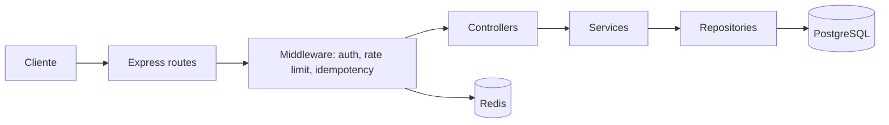

# Ledger API

API de carteira digital (double-entry ledger) em Node.js + TypeScript + Express + PostgreSQL (Prisma) + Redis.

## 1. O que é

Ledger API é o backend de uma carteira digital: usuários se registram, abrem contas, recebem depósitos administrativos e transferem saldo entre contas. Não é um app de exemplo com CRUD solto por cima de um banco — o projeto existe para provar correção sob concorrência: duas transferências simultâneas sobre a mesma conta nunca deixam o saldo inconsistente, um cliente que reenvia a mesma requisição (timeout, retry de rede) nunca é cobrado duas vezes, e o saldo de cada conta é sempre reconstruível a partir do histórico de lançamentos.

Não há double-entry "de mentirinha": todo movimento de dinheiro — inclusive depósito — é uma transferência real entre duas contas, com dois lançamentos (`LedgerEntry`) de igual valor e sinais opostos. `Account.balance` é um cache mantido pela mesma transação que grava os lançamentos; a fonte de verdade é a soma dos lançamentos.

## 2. Por que assim (log de decisões)

- **Double-entry.** Cada transferência gera exatamente 1 `LedgerEntry` `DEBIT` na conta de origem e 1 `CREDIT` na conta de destino, sempre no mesmo valor. `LedgerEntry` é a verdade contábil; `Account.balance` é um cache denormalizado atualizado na mesma transação — nunca a única fonte do saldo.
- **Valores em centavos, `BigInt`.** `Account.balance`, `Transfer.amount` e `LedgerEntry.amount`/`balanceAfter` são `BigInt` em centavos no banco (colunas Postgres `BIGINT`). Elimina erro de ponto flutuante em dinheiro; a API expõe esses valores como `string` no JSON (JS `number` não representa `BigInt` com segurança).
- **Lock `FOR UPDATE` por `id` ascendente.** Antes de mover saldo, `performTransfer` (`src/modules/transfers/ledger.repository.ts`) trava as duas linhas de `Account` envolvidas com `SELECT ... FOR UPDATE`, sempre na ordem lexicográfica dos dois ids. Isso serializa transferências concorrentes que tocam a mesma conta e evita deadlock: não importa a ordem em que duas transferências concorrentes (A→B e B→A) cheguem, ambas tentam travar as linhas na mesma ordem.
- **Idempotência em duas camadas.** A camada rápida é um cache de resposta no Redis por `Idempotency-Key` (mesma chave → mesmo corpo/status devolvido do cache, sem tocar o banco de novo) com um lock curto para não processar duas requisições simultâneas com a mesma chave. A camada definitiva é a constraint `@unique` em `Transfer.idempotencyKey` no Postgres: se duas requisições com a mesma chave escaparem do Redis (ex.: corrida entre duas réplicas), a segunda `INSERT` colide (`P2002`) e o serviço devolve a `Transfer` já criada em vez de duplicar o movimento. O Redis dá replay rápido; o banco dá a garantia sob corrida real. Uma escolha explícita: se a mesma `Idempotency-Key` voltar com um **corpo diferente** (outro valor, outras contas), a API devolve a resposta original armazenada em vez de erro — é a semântica clássica de idempotency key ("esta chave já tem uma resposta"). Alguns provedores (Stripe, por exemplo) preferem responder 422 quando o payload não bate com o da primeira chamada; aqui isso não é feito.
- **Conta treasury.** Existe uma conta especial (`id = "treasury"`, ver `src/config/constants.ts`) que não passa pela checagem de saldo suficiente. Todo depósito administrativo é, por baixo, uma transferência da treasury para a conta do usuário — não existe um caminho de código separado que "cria dinheiro". Isso mantém a invariante contábil: a soma dos saldos de todas as contas de usuário é sempre igual a `-1 × saldo da treasury` (o sistema como um todo soma zero).

## 3. Arquitetura



Camadas: `routes` fazem parsing/validação de entrada (Zod) e amarram middleware; `controllers` traduzem HTTP ↔ chamadas de serviço; `services` contêm as regras de negócio (posse de conta, RBAC, orquestração de transferência). `repositories` concentram a lógica transacional mais sensível — em especial `LedgerRepository.performTransfer`, o núcleo transacional por onde passa todo movimento de dinheiro, dentro de uma única transação Prisma; alguns services (auth, health, leitura de transfer) chamam o Prisma diretamente para queries simples, sem passar por um repository. Redis é usado para o cache de idempotência e como store do rate limiter (`rate-limit-redis`), não para lógica de negócio.

## 4. Rodar local

O projeto foi desenvolvido com Postgres e Redis nativos na máquina (não em container) — mais rápido para iterar sem esperar `docker compose build` a cada mudança. As instruções abaixo documentam **o caminho Docker completo** (o que um leitor do repositório provavelmente vai usar) e citam a variação nativa entre parênteses.

Pré-requisitos: Docker (ou Postgres 16 + Redis 7 instalados localmente) e Node 20+.

```bash
# 1. Sobe Postgres + Redis + a própria API em containers, builda a imagem de produção.
#    `app` só sobe depois que o healthcheck do `postgres` reporta saudável (compose
#    `depends_on: postgres: condition: service_healthy`), então não há corrida entre o
#    `prisma migrate deploy` do entrypoint e o Postgres ainda subindo.
docker compose up -d --build

# Não há passo manual de migrate nem de seed: o entrypoint.sh do container `app` roda
# `prisma migrate deploy` e em seguida `node dist/prisma/seed.js` antes de subir o
# servidor. O seed sempre cria/atualiza um usuário "system" (email
# system@ledger.local, senha aleatória descartada na hora, nunca logável) que é o
# dono da conta treasury — isso é incondicional, porque depósitos e transferências
# dependem só da treasury existir. Um usuário ADMIN de verdade (admin@ledger.local),
# esse sim logável, só é criado se a env var `ADMIN_PASSWORD` estiver definida antes
# do primeiro boot do container; sem ela, a treasury e as transferências entre contas
# existentes funcionam normalmente, só a rota de depósito (ADMIN-only) fica
# inacessível até alguém provisionar um admin. Local: defina `ADMIN_PASSWORD` no
# `.env`/`docker-compose.yml`. Render: defina pelo dashboard do serviço (env var
# `sync: false` em `render.yaml`, nunca commitada). O seed é `upsert`, então repetir
# a cada boot é inofensivo. Ele roda o JS compilado e não `npm run prisma:seed`,
# porque a imagem de runtime não copia `src/` — o `prisma/seed.ts` importa
# `../src/config/constants.js`, que só existe lá como `dist/src/config/constants.js`.

# 2. Testar
curl -fsS http://localhost:3000/health
```

Caminho nativo (o usado para construir o projeto): suba só a infra em container (`docker compose up -d postgres redis`, sem `app`), depois `npm ci`, `npm run prisma:migrate`, `npm run prisma:seed`, `npm run dev` (usa `tsx watch`, hot reload).

Variáveis de ambiente: ver `.env.example`. Em Docker Compose os hosts de `DATABASE_URL`/`REDIS_URL` do serviço `app` usam os nomes dos serviços (`postgres`, `redis`), não `localhost` — só o host roda em `localhost`.

## 5. Testes

```bash
npm run test              # suíte completa (vitest, contra ledger_test via .env.test)
npm run test -- --coverage
```

Quatro classes de cenário são o coração da suíte:

- **Unit** (`tests/unit/`) — regras puras sem I/O: `parseAmountToCents`/`centsToString` (conversão e validação de centavos) e a hierarquia `AppError`.
- **Integração** (`tests/integration/*.test.ts`) — toda a superfície HTTP via `supertest` contra `buildApp()`: auth, accounts, deposits, transfers, statement, health, error handler, rate limit, middleware de auth, schema/OpenAPI.
- **Concorrência** (`tests/integration/concurrency.test.ts`) — dispara transferências em paralelo com `Promise.allSettled` sobre a mesma conta: duas transferências que juntas excedem o saldo (uma passa, uma falha com `InsufficientFundsError`, saldo final correto). O terceiro caso do arquivo, o de reconciliação, é **sequencial** de propósito — três `await executeTransfer(...)` um após o outro — porque o que ele mede é a invariante contábil (soma dos `LedgerEntry` = `Account.balance`), não a corrida.
- **Idempotência** — as duas camadas são testadas separadamente. Na camada de serviço/banco (`concurrency.test.ts`), `executeTransfer` é chamado 8x em paralelo com a mesma chave **direto no service, sem nenhum header HTTP**: uma processa e as outras 7 reusam a `Transfer` já criada, via a unique de `Transfer.idempotencyKey`. Na camada HTTP (`idempotency.test.ts`), o header `Idempotency-Key` é de fato exercido: mesma chave duas vezes em série devolve corpo e status idênticos do cache Redis; duas requisições genuinamente paralelas com a mesma chave acabam em 201 + 409 (a perdedora bate no lock Redis) com uma única `Transfer` no banco; chaves diferentes geram transferências diferentes; sem o header, 400.

## 6. Exemplos `curl`

```bash
BASE=http://localhost:3000

# Registrar
curl -s -X POST $BASE/auth/register \
  -H 'Content-Type: application/json' \
  -d '{"email":"alice@example.com","password":"supersecret1"}'
# 201 -> {"id":"clx...","email":"alice@example.com","role":"USER"}

# Login (guardar o token)
TOKEN=$(curl -s -X POST $BASE/auth/login \
  -H 'Content-Type: application/json' \
  -d '{"email":"alice@example.com","password":"supersecret1"}' | node -pe 'JSON.parse(require("fs").readFileSync(0)).token')
# resposta crua: 200 -> {"token":"eyJhbGciOi..."}

# Criar conta
ACCOUNT_ID=$(curl -s -X POST $BASE/accounts \
  -H "Authorization: Bearer $TOKEN" | node -pe 'JSON.parse(require("fs").readFileSync(0)).id')
# 201 -> {"id":"...","userId":"...","balance":"0","currency":"BRL","createdAt":"..."}

# Depósito (requer usuário ADMIN — só existe se ADMIN_PASSWORD foi definida antes
# do boot do container; o email é sempre admin@ledger.local, a senha é o valor que
# você definiu em ADMIN_PASSWORD — ver seção 4)
ADMIN_TOKEN=$(curl -s -X POST $BASE/auth/login \
  -H 'Content-Type: application/json' \
  -d '{"email":"admin@ledger.local","password":"'"$ADMIN_PASSWORD"'"}' | node -pe 'JSON.parse(require("fs").readFileSync(0)).token')

curl -s -X POST $BASE/accounts/$ACCOUNT_ID/deposits \
  -H "Authorization: Bearer $ADMIN_TOKEN" \
  -H 'Content-Type: application/json' \
  -d '{"amount":10000}'
# 201 -> {"id":"...","fromAccountId":"treasury","toAccountId":"...","amount":"10000","status":"COMPLETED","createdAt":"..."}

# Transferência (Idempotency-Key é obrigatório; reenviar a mesma chave devolve a mesma resposta)
curl -s -X POST $BASE/transfers \
  -H "Authorization: Bearer $TOKEN" \
  -H 'Content-Type: application/json' \
  -H "Idempotency-Key: $(node -pe 'require("crypto").randomUUID()')" \
  -d "{\"fromAccountId\":\"$ACCOUNT_ID\",\"toAccountId\":\"<outra-conta>\",\"amount\":2500}"
# 201 (ou 200 se a mesma Idempotency-Key já tiver sido processada) -> DTO de Transfer

# Extrato
curl -s "$BASE/accounts/$ACCOUNT_ID/statement?limit=20" \
  -H "Authorization: Bearer $TOKEN"
# 200 -> {"entries":[{"id":"...","transferId":"...","direction":"DEBIT","amount":"2500","balanceAfter":"7500","createdAt":"..."}],"nextCursor":null}
```

Formato de erro (todo erro de domínio segue este shape; ver `src/middleware/errorHandler.ts` e `src/domain/errors.ts`):

```json
{
  "error": {
    "code": "INSUFFICIENT_FUNDS",
    "message": "Insufficient funds",
    "requestId": "a1b2c3d4"
  }
}
```

| Status | `code`                            | Quando                                                                                                               |
| ------ | --------------------------------- | -------------------------------------------------------------------------------------------------------------------- |
| 400    | `VALIDATION_ERROR`                | body/query inválidos (Zod)                                                                                           |
| 401    | `AUTH_ERROR`                      | token ausente, inválido ou expirado; credenciais inválidas no login                                                  |
| 403    | `FORBIDDEN`                       | conta/transferência de outro usuário; rota `ADMIN` com token `USER`                                                  |
| 404    | `NOT_FOUND` / `ACCOUNT_NOT_FOUND` | recurso inexistente                                                                                                  |
| 409    | `CONFLICT`                        | e-mail já registrado; requisição com a mesma `Idempotency-Key` já em voo; transação abortada por contenção (`P2028`) |
| 422    | `INSUFFICIENT_FUNDS`              | saldo insuficiente para a transferência                                                                              |
| 429    | `RATE_LIMITED`                    | limite de requisições excedido (`/auth/*` e `POST /transfers`)                                                       |
| 500    | `INTERNAL`                        | erro não mapeado                                                                                                     |

## 7. Docs e demo

- Swagger UI: `GET /docs` (spec servida também em `GET /openapi.yaml`).
- Demo ao vivo: `<preencher após o deploy — ver Apêndice do plano>`.
- Deploy (Render): o blueprint `render.yaml` declara o web service e o Postgres. **Redis não é declarado ali** — provisione à parte (Render Key Value/Redis ou Upstash) e cole a connection string em `REDIS_URL` pelo painel do serviço. Não existe passo manual de migrate ou seed depois do deploy: o `entrypoint.sh` roda `prisma migrate deploy` + o seed a cada boot. Isso é o que torna o free tier viável — ele não dá shell no container, então qualquer runbook que dependesse de "rodar o seed pelo shell do Render" simplesmente não teria como ser executado. O seed sempre cria a conta treasury (dona: um usuário "system" não-logável). Para ter um admin logável em produção, defina `ADMIN_PASSWORD` no painel do serviço **antes** do primeiro boot (`render.yaml` declara essa var com `sync: false`, então o Render pede o valor no deploy e nunca a commita); sem ela, o deploy sobe normalmente, mas a rota de depósito fica inacessível até você definir a var e reiniciar o serviço.

## 8. Limitações conhecidas

- **Paginação por cursor não é estritamente cronológica.** `GET /accounts/:id/statement` pagina por `id` (cuid) decrescente, não por `createdAt`. cuids são ordenáveis lexicograficamente por ordem de geração, o que garante paginação estável (sem duplicatas nem gaps entre páginas mesmo com inserções concorrentes), mas não é uma garantia cronológica exata — ver comentário em `src/modules/accounts/accounts.repository.ts`.
- **Moeda única por conta, sem conversão.** `Account.currency` existe no schema mas hoje é sempre `"BRL"`; não há taxa de câmbio nem transferência entre moedas.
- **`POST /accounts/:id/deposits` não é idempotente.** Diferente de `POST /transfers`, o depósito não aceita `Idempotency-Key`: cada chamada gera uma chave interna nova (`deposit:${randomUUID()}`), então um cliente que der retry depois de um timeout cria uma segunda transferência real — crédito em dobro. É uma assimetria aceita de propósito, não um descuido: depósito é rota `ADMIN`, de baixo volume e com operador humano no circuito, enquanto `/transfers` é a rota exposta ao cliente e essa sim tem a garantia completa via o header.
- **Sem refresh token.** `POST /auth/login` emite um único JWT com expiração fixa (`JWT_EXPIRES_IN`, padrão 1h); expirado, o cliente precisa logar de novo — não há endpoint de refresh nem revogação de token.
- **Redis free do Render hiberna.** Se o Redis do deploy usar o free tier (Render ou Upstash), ele pode hibernar por inatividade; a primeira requisição após um período ocioso pode ser mais lenta ou falhar até o Redis acordar (afeta o rate limiter e o cache de idempotência, não a integridade dos dados — a constraint `@unique` no banco continua garantindo idempotência mesmo se o Redis estiver fora do ar).
